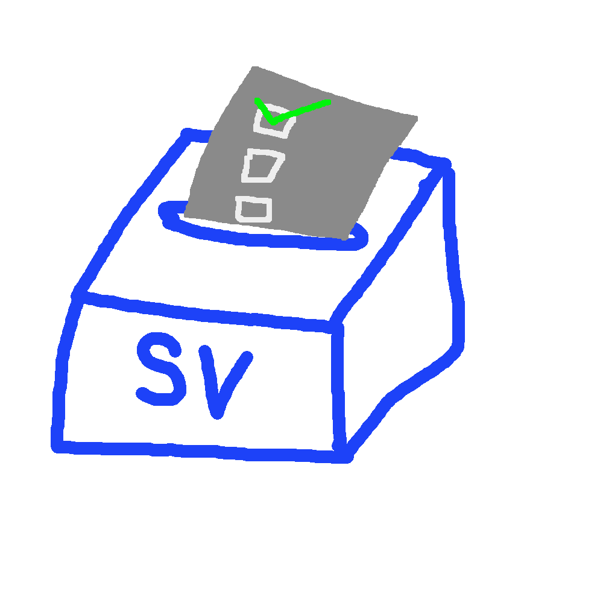

<div id="top"></div>

<!-- PROJECT SHIELDS -->

[![Ethereum][ethereum-shield]][ethereum-url]
[![Next][next-shield]][next-url]
[![React][react-shield]][react-url]
[![Node][node-shield]][node-url]

<!-- PROJECT LOGO -->
<br />
<div align="center">
  <a href="https://github.com/Pyxels/SimpleVote">
    
  </a>

  <h3 align="center">SimpleVote</h3>

  <p align="center">
    Secure and verifiable voting powered by blockchain.
    <br />
    <a href="https://github.com/Pyxels/SimpleVote"><strong>Explore the repo »</strong></a>
    <br />
    <br />
    <a href="https://github.com/Pyxels/SimpleVote">View Demo</a>
    ·
    <a href="https://github.com/Pyxels/SimpleVote/issues">Report Bug</a>
    ·
    <a href="https://github.com/Pyxels/SimpleVote/issues">Request Feature</a>
  </p>
</div>

<!-- TABLE OF CONTENTS -->
<details>
  <summary>Table of Contents</summary>
  <ol>
    <li>
      <a href="#about-the-project">About The Project</a>
      <ul>
        <li><a href="#built-with">Built With</a></li>
        <li><a href="#disclaimer">Disclaimer</a></li>
      </ul>
    </li>
    <li>
      <a href="#getting-started">Getting Started</a>
      <ul>
        <li><a href="#prerequisites">Prerequisites</a></li>
        <li><a href="#installation">Installation</a></li>
      </ul>
    </li>
    <li><a href="#usage">Usage</a></li>
    <li><a href="#roadmap">Roadmap</a></li>
    <li><a href="#contributing">Contributing</a></li>
    <li><a href="#license">License</a></li>
    <li><a href="#contact">Contact</a></li>
    <li><a href="#acknowledgments">Acknowledgments</a></li>
  </ol>
</details>

<!-- ABOUT THE PROJECT -->

## About The Project

![Product Name Screen Shot][product-screenshot]

For a university course, we created a simple Voting application which can be hosted on an ethereum blockchain, along with a frontend to interact with this smart contract.
This application offers any user to create their own VoteRoom to which any address can be invited.
The owner of a VoteRoom can create private votes in which only the invited voters can vote, or create public votes which are open to any user with sufficient funds.

<p align="right">(<a href="#top">back to top</a>)</p>

### Built With

- [Next.js](https://nextjs.org/)
- [React.js](https://reactjs.org/)
- [Ethereum](https://ethereum.org/en/)
- [Node.js](https://nodejs.org/en/)

<p align="right">(<a href="#top">back to top</a>)</p>

<!-- DISCLAIMER -->

## Disclaimer

⚠️ This is a simple proof-of-concept university project and should not be used in any real world application.

<!-- GETTING STARTED -->

## Getting Started

### Prerequisites

- npm
- [Node.js](https://nodejs.org/en/)
- [Metamask](https://metamask.io/)

### Installation

1. Pull the repo
2. Move into the directory

```sh
cd SimpleVote/
```

3. Install all dependencies

```sh
npm install
npm run postinstall
```

4. Run the server

```
node server.js
```

5. Go to `localhost:3000` with the right credentials on Metamask

<p align="right">(<a href="#top">back to top</a>)</p>

<!-- USAGE EXAMPLES -->

## Usage

1. The home page is an overview over all rooms with some basic stats, like invited users and amount of votes.
   ![All Rooms][all-rooms]
2. Clicking on the `Create VoteRoom` button takes you to the creation view.
   ![Create new Room][new-room]
3. Looking at a specific room, you can see alot of details.
   ![Room Details][room-overview]
4. Looking at the votes for a room, you can see a list with buttons/actions to take.
   ![Votes Overview][votes-overview]
5. The manager can also crate a new vote by clicking `Add Vote`.
   ![New Vote][new-vote]

<p align="right">(<a href="#top">back to top</a>)</p>

<!-- ROADMAP -->

## Roadmap

- [x] Refactor Frontend to use functional components
- [x] Add loading spinners
- [ ] Easier site navigation
- [ ] Dark theme

See the [open issues](https://github.com/Pyxels/SimpleVote/issues) for a full list of proposed features (and known issues).

<p align="right">(<a href="#top">back to top</a>)</p>

## Contact

Project Link: [https://github.com/Pyxels/SimpleVote](https://github.com/Pyxels/SimpleVote)

<p align="right">(<a href="#top">back to top</a>)</p>

<!-- ACKNOWLEDGMENTS -->

## Acknowledgments

- [S2BCAcademys Example which helped with the basic setup](https://github.com/S2BCAcademy/CrowdFund_EduMaster)
- The professor which offered this course and the ressources

<p align="right">(<a href="#top">back to top</a>)</p>

<!-- MARKDOWN LINKS & IMAGES -->
<!-- https://www.markdownguide.org/basic-syntax/#reference-style-links -->

[ethereum-shield]: https://img.shields.io/badge/Ethereum-3C3C3D?style=for-the-badge&logo=Ethereum&logoColor=white
[ethereum-url]: https://ethereum.org/en/
[next-shield]: https://img.shields.io/badge/Next-black?style=for-the-badge&logo=next.js&logoColor=white
[next-url]: https://nextjs.org/
[react-shield]: https://img.shields.io/badge/react-%2320232a.svg?style=for-the-badge&logo=react&logoColor=%2361DAFB
[react-url]: https://reactjs.org/
[node-shield]: https://img.shields.io/badge/node.js-6DA55F?style=for-the-badge&logo=node.js&logoColor=white
[node-url]: https://nodejs.org/en/
[product-screenshot]: images/screenshot.png
[all-rooms]: images/all-rooms.png
[new-room]: images/new-room.png
[room-overview]: images/room-overview.png
[votes-overview]: images/votes-overview.png
[new-vote]: images/new-vote.png
